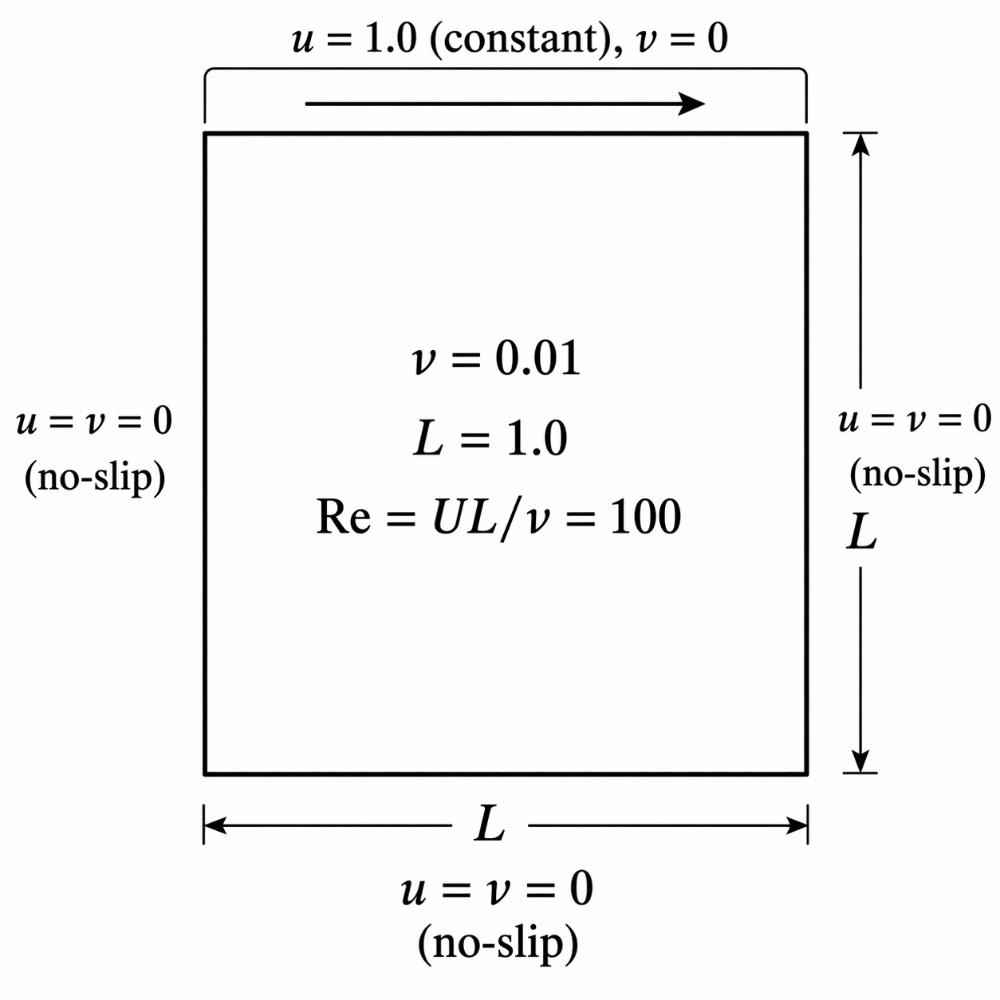
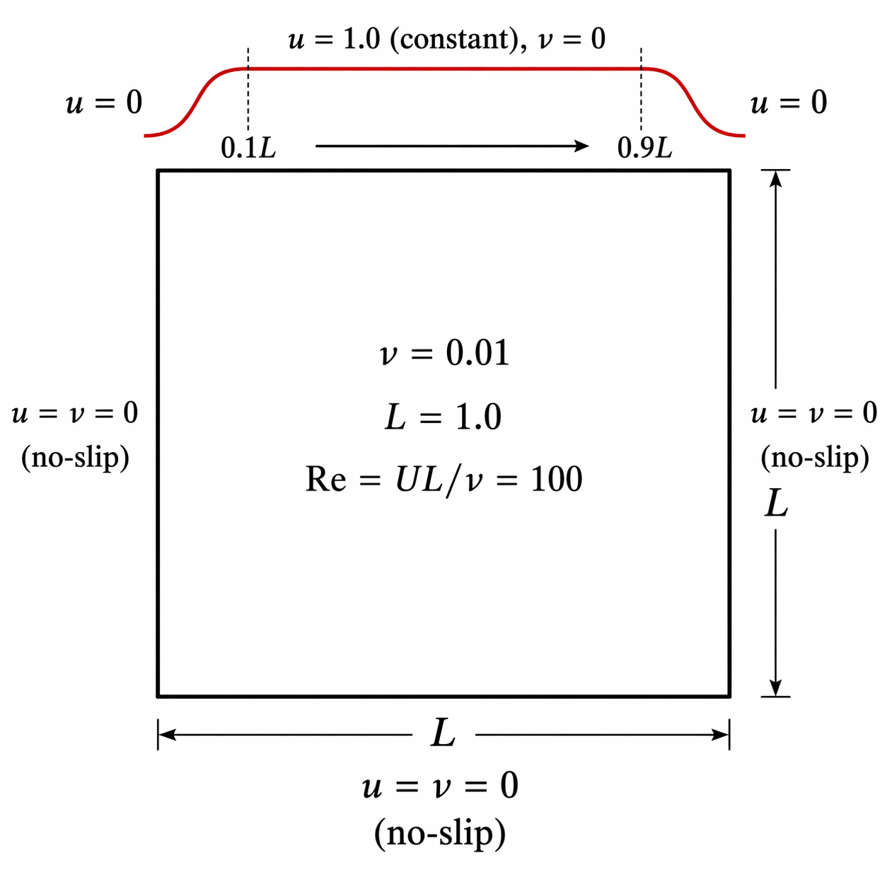

# PINN — Lid-Driven Cavity Flow

A Physics Informed Neural Network (PINN) that solves the 2D incompressible Navier-Stokes equations for the classic lid-driven cavity problem, without a finite difference or finite volume grid, directly from the governing equations and boundary conditions.

<p align="center">
  
</p>
<p align="center"><em>Problem setup: the top lid moves at u = 1 across its full width, driving a recirculating vortex inside the unit square cavity. The three remaining walls are stationary (no-slip).</em></p>

<p align="center">
  
</p>
<p align="center"><em>Training animation — Re=100, uniform lid velocity (u=1), 1x network (12,867 parameters). Vorticity field with streamlines, pressure field with −∇p vectors, and streamfunction isolines evolving over 40,000 epochs.</em></p>

---

## The CFD Problem

The lid-driven cavity is a canonical benchmark in computational fluid dynamics. The domain is a unit square [0,1]² filled with a viscous, incompressible fluid. The top lid (y=1) moves horizontally at unit velocity (u=1), while the three remaining walls are stationary. This drives an asymmetric circulating vortex inside the cavity.

The governing equations are the incompressible Navier-Stokes equations:

**x-dir momentum conservation:**
$$u \frac{\partial u}{\partial x} + v \frac{\partial u}{\partial y} + \frac{\partial p}{\partial x} - \nu \left(\frac{\partial^2 u}{\partial x^2} + \frac{\partial^2 u}{\partial y^2}\right) = 0$$

**y-dir  momentum conservation:**
$$u \frac{\partial v}{\partial x} + v \frac{\partial v}{\partial y} + \frac{\partial p}{\partial y} - \nu \left(\frac{\partial^2 v}{\partial x^2} + \frac{\partial^2 v}{\partial y^2}\right) = 0$$

**Mass conservation:**
$$\frac{\partial u}{\partial x} + \frac{\partial v}{\partial y} = 0$$

where `u`, `v` are the velocity components, `p` is pressure, and `ν = 0.01` is the kinematic viscosity (Re = 100).

---

## The PINN Network

A fully-connected neural network takes a spatial coordinate `(x, y)` as input and outputs the three flow fields simultaneously:

```
(x, y)  →  [Linear → Tanh] × 4  →  Linear  →  (u, v, p)
```

Architecture: `[2, 64, 64, 64, 64, 3]` (12,867 parameters) — two input neurons, four hidden layers of 64 neurons with Tanh activations, three output neurons. Tanh is chosen over ReLU because the NS equations involve second-order derivatives, which vanish for ReLU activations.

The network is a continuous function approximator — it represents the flow field at every point in the domain, not just on a fixed mesh.

---

## Boundary Conditions

The boundary condition loss penalizes the network for violating the no-slip and lid conditions on all four walls:

| Wall | Condition |
|------|-----------|
| Bottom (y=0) | u=0, v=0 |
| Top (y=1) — the lid | u=1, v=0 |
| Left (x=0) | u=0, v=0 |
| Right (x=1) | u=0, v=0 |

`N_b = 1,000` points are sampled uniformly along the four walls. The BC loss is:

$$\mathcal{L}_{BC} = \frac{1}{N_b} \sum_i \left[ (u_{pred} - u_{BC})^2 + (v_{pred} - v_{BC})^2 \right]$$

---

## Loss Functions

The total training loss combines three terms:

$$\mathcal{L} = 10 \cdot \mathcal{L}_{BC} + \mathcal{L}_{PDE} + 10 \cdot \mathcal{L}_{p}$$

**BC loss** `L_BC` — enforces boundary conditions on the walls (above).

**PDE loss** `L_PDE` — enforces the Navier-Stokes equations at collocation points in the interior (see below).

**Pressure gauge fix** `L_p` — the incompressible NS equations only determine pressure up to an additive constant (if `p(x,y)` is a solution, so is `p(x,y) + k`). We pin `p(0.5, 0.5) = 0`:

$$\mathcal{L}_{p} = p(0.5, 0.5)^2$$

The factor of 10 on `L_BC` and `L_p` weights them more heavily than the PDE residual, ensuring the network first satisfies the boundary conditions before fitting the interior.

---

## L_PDE and Collocation Points

`N_f = 10,000` collocation points are sampled randomly in the interior of [0,1]². These points carry **no labels** — there is no ground truth velocity or pressure to compare against. Instead, the network is penalised for failing to satisfy the PDE at each point:

$$\mathcal{L}_{PDE} = \frac{1}{N_f} \sum_i \left( r_x^2 + r_y^2 + r_c^2 \right)$$

where `r_x`, `r_y`, `r_c` are the residuals of the x-momentum, y-momentum, and mass conservation equations evaluated at each collocation point. A perfect solution to the NS equations would give `L_PDE = 0`.

### Evaluation L_PDE

After each training step, `L_PDE` is also evaluated on a fresh set of `N_eval = 2,000` randomly sampled points (independent of the training collocation points). This gives an unbiased estimate of how well the network satisfies the PDE across the domain — analogous to a validation loss.

---

## How Autograd Works on Collocation Points

Computing the NS residual requires spatial derivatives of the network outputs — `∂u/∂x`, `∂²u/∂x²`, `∂p/∂x`, etc. These are obtained via PyTorch's automatic differentiation, not finite differences.

The collocation points are created with `requires_grad=True`:

```python
x_f = torch.rand(N_f, 1, requires_grad=True)
y_f = torch.rand(N_f, 1, requires_grad=True)
```

This tells PyTorch to track all operations involving `x_f` and `y_f` in a computation graph. When the network computes `u = net(x_f, y_f)`, the graph records the dependency of `u` on `x_f`. First and second derivatives are then computed exactly:

```python
u_x  = grad(u.sum(), x_f, create_graph=True)[0]   # ∂u/∂x
u_xx = grad(u_x.sum(), x_f, create_graph=True)[0]  # ∂²u/∂x²
```

`create_graph=True` is required for second derivatives; it tells PyTorch to keep the graph of `u_x` so that it can be differentiated again to get `u_xx`.

During the training backward pass, gradients flow all the way through the derivative computation back to the network weights, so the optimizer can minimize the PDE residual by adjusting the network parameters.

---

## Inference

Once trained, the network is a meshfree surrogate for the flow field. Any point `(x, y) ∈ [0,1]²` can be queried instantly:

```python
with torch.no_grad():
    u, v, p = net(torch.tensor([[0.5]]), torch.tensor([[0.8]]))
```

`torch.no_grad()` is used here because we only want the network's predictions — no derivatives w.r.t. the weights are needed.

To evaluate `L_PDE` at inference time (e.g. on a large point cloud for a high-fidelity accuracy estimate), `torch.no_grad()` cannot be used because the NS residual still requires autograd through the input coordinates. The network weights are not updated; no `.backward()` or `.step()` is called. But the input coordinates must remain in the computation graph.

---

## File Structure

```
pinn.py          # PINN model, NS residual, data helpers
notebook.ipynb   # Training driver, visualisation
pyproject.toml   # Dependencies
uv.lock          # Pinned package versions
```

## Setup

```bash
uv sync
jupyter notebook
```

---

## Results

### Standard lid (u = 1 uniformly along the top lid)

<p align="center">
  
</p>
<p align="center"><em>Problem setup: the top lid moves at speed u = 1.0 across its full width. The three remaining walls are stationary (no-slip). This creates a velocity discontinuity at the two top corners.</em></p>

<p align="center">
  
</p>
<p align="center"><em>

**Row 1: Vorticity and pressure.** Left: vorticity field ω = ∂v/∂x − ∂u/∂y overlaid with streamlines (ψ-isolines with directional arrows), showing the primary recirculating vortex. Right: pressure field with −∇p vectors, capturing the pressure gradient that drives the flow.

**Row 2: PDE and BC residuals.** Left: pointwise NS residual r²(x,y) across the interior — low values confirm the network satisfies the governing equations. Right: boundary condition error scattered on all four walls — the top lid shows the largest error near the singular corners.

**Row 3: Cross-sectional velocity profiles.** Horizontal slices of u and v at three depths: y = 0.001 (near bottom wall, blue), y = 0.5 (mid-cavity, black), y = 0.999 (near lid, red).

**Row 4: Training and evaluation loss curves.** L_PDE, L_BC, and L_p plotted on a log scale for both training collocation points and an independent evaluation set.
</em></p>

At epoch 27,000 the network predicts u = 0.7225 at (x=0.5, y=0.9609), within 2% of the Ghia et al. (1982) finite-difference benchmark value of 0.73722 for Re = 100 — a standard reference point for validating lid-driven cavity solvers.

```
epoch  27000 | L_bc 1.273e-03 | L_pde 1.900e-03 | L_p 1.212e-07 | eval L_pde 2.322e-03
  u(0.5, 0.9609) = 0.7225   (expect 0.73722 — Ghia et al, 1982. Re=100)
  v(0.5, 0.9609) = 0.0120
  p(0.5, 0.9609) = -0.0388
  bottom (y=0) : u mean=-0.0062  std=0.0021   v mean=0.0010  std=0.0014
  left   (x=0) : u mean=-0.0006  std=0.0452   v mean=0.0025  std=0.0136
  right  (x=1) : u mean=-0.0040  std=0.0393   v mean=-0.0032  std=0.0136
  ```
---

### Sigmoid-smoothed lid (u ramps from 0 at the corners)

<p align="center">
  
</p>
<p align="center"><em>Modified boundary condition: the lid velocity is smoothed with sigmoid ramps over the left and right 10% of the top lid, eliminating the velocity discontinuity at the corners and making the problem more amenable to a neural network solution.</em></p>

<p align="center">
  
</p>
<p align="center"><em>Flow field at epoch 25,000 with the sigmoid lid BC (Re = 100). The smoothed corners allow the network to converge faster and to a cleaner solution compared to the discontinuous lid.</em></p>

---

## Videos

Training animations are saved to `videos/`. Each run produces two files: a flow field video (3-panel, every 10 epochs) and a dashboard video (4-row, every 100 epochs).

| File | Contents | Duration |
|------|----------|----------|
| `videos/flow_Re100_uniformU_1xhidden.mp4` | Vorticity, pressure, streamlines | ~8 s @ 250 fps |
| `videos/flow_Re100_uniformU_1xhidden.gif` | Same, 960px wide GIF | ~8 s @ 50 fps |
| `videos/dashboard_Re100_uniformU_1xhidden.mp4` | Full 4-row dashboard | ~8 s @ 25 fps |
| `videos/dashboard_Re100_uniformU_1xhidden.gif` | Same, 1200px wide GIF | ~8 s @ 15 fps |

**Reproduce with ffmpeg:**

```bash
# Flow field mp4 — 2001 frames (every 10 epochs) at 250 fps → ~8 s
ls images/flow_Re100_uniformU_1xhidden/epoch=*.png | sort | \
  while read f; do echo "file '$(pwd)/$f'"; echo "duration 0.004"; done > /tmp/frames.txt
ffmpeg -y -f concat -safe 0 -i /tmp/frames.txt \
  -vf "scale=trunc(iw/2)*2:trunc(ih/2)*2" \
  -c:v libx264 -crf 28 -preset slow -pix_fmt yuv420p \
  videos/flow_Re100_uniformU_1xhidden.mp4

# Dashboard mp4 — 201 frames (every 100 epochs) at 25 fps → ~8 s
ls images/dashboard_Re100_uniformU_1xhidden/epoch=*.png | sort | \
  while read f; do echo "file '$(pwd)/$f'"; echo "duration 0.04"; done > /tmp/frames.txt
ffmpeg -y -f concat -safe 0 -i /tmp/frames.txt \
  -vf "scale=trunc(iw/2)*2:trunc(ih/2)*2" \
  -c:v libx264 -crf 28 -preset slow -pix_fmt yuv420p \
  videos/dashboard_Re100_uniformU_1xhidden.mp4

# GIFs (960px and 1200px wide, same ~8 s duration)
ffmpeg -y -i videos/flow_Re100_uniformU_1xhidden.mp4 \
  -vf "fps=50,scale=960:-1:flags=lanczos,split[s0][s1];[s0]palettegen[p];[s1][p]paletteuse" \
  -loop -1 videos/flow_Re100_uniformU_1xhidden.gif

ffmpeg -y -i videos/dashboard_Re100_uniformU_1xhidden.mp4 \
  -vf "fps=15,scale=1200:-1:flags=lanczos,split[s0][s1];[s0]palettegen[p];[s1][p]paletteuse" \
  -loop -1 videos/dashboard_Re100_uniformU_1xhidden.gif
```
