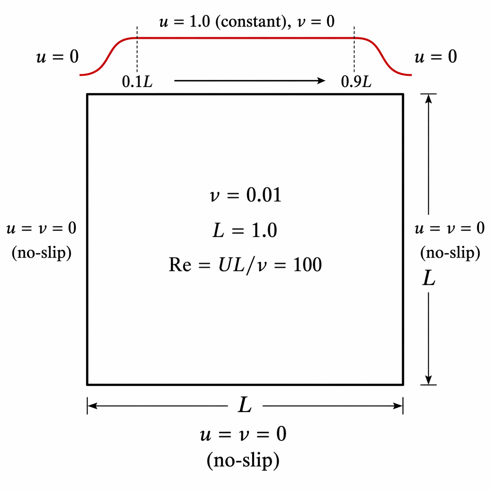

# PINN — Lid-Driven Cavity Flow

A Physics-Informed Neural Network (PINN) that solves the 2D incompressible Navier-Stokes equations for the classic lid-driven cavity benchmark, without a grid, directly from the governing equations and boundary conditions.

<p align="center">
  
</p>
<p align="center"><em>The top lid moves at u = 1, driving a recirculating vortex inside the unit square. Three walls are stationary (no-slip).</em></p>

<p align="center">
  
</p>
<p align="center"><em>Training animation — Re=100, uniform lid, 1x network (12,867 parameters). Vorticity + streamlines, pressure + −∇p vectors, streamfunction isolines over 40,000 epochs.</em></p>

---

## The Problem

The lid-driven cavity is a canonical CFD benchmark. The domain is [0,1]² with a viscous incompressible fluid. The top lid moves at u=1; three walls are no-slip. This drives a recirculating vortex. We solve at Re=100 (ν=0.01).

The network takes `(x, y)` as input and simultaneously outputs `(u, v, p)` — velocity and pressure at every point in the domain. No mesh, no finite differences: all spatial derivatives are computed via PyTorch autograd.

See [DESIGN.md](DESIGN.md) for the full formulation: NS equations, loss function, boundary conditions, collocation points, autograd, and SIREN.

---

## Network Architecture

```
(x, y)  →  [Linear → tanh/sin] × 4  →  Linear  →  (u, v, p)
```

Default: `[2, 64, 64, 64, 64, 3]` — 12,867 parameters. ReLU cannot be used because the NS residual requires second-order spatial derivatives, which vanish for ReLU. We experiment with tanh and SIREN (sinusoidal) activations.

<p align="center">
  
</p>

---

## Width Sweep Results

We train 10 networks doubling width from 4 → 2048, measuring how accuracy scales with capacity. Key finding: **SIREN (sinusoidal activation) errors decrease consistently with width. Tanh degrades at width ≥ 128** due to neuron saturation.

#### tanh baseline

| Width | Params | Epochs | eval_L_pde | u_ghia | Error vs Ghia |
|------:|-------:|-------:|-----------:|-------:|--------------:|
| 4 | 87 | 22,000 | 2.427e-02 | 0.6188 | 0.1184 |
| 8 | 267 | 32,500 | 1.799e-02 | 0.6360 | 0.1012 |
| 16 | 915 | 54,000 | 1.840e-03 | 0.7128 | 0.0244 |
| 32 | 3,363 | 45,000 | 1.350e-03 | 0.7178 | 0.0194 |
| 64 | 12,867 | 39,000 | 1.035e-03 | 0.7283 | 0.0089 |
| 128 | 50,307 | 26,500 | 8.131e-03 | 0.6922 | **0.0450 ↑** |
| 256 | 198,915 | 22,000 | 1.648e-02 | 0.5954 | **0.1418 ↑** |

#### SIREN sweep (width 2048 in progress)

| Width | Params | N_f | Epochs | eval_L_pde | u_ghia | Error vs Ghia |
|------:|-------:|----:|-------:|-----------:|-------:|--------------:|
| 4 | 87 | 10,000 | 25,500 | 2.129e-02 | 0.6125 | 0.1247 |
| 8 | 267 | 10,000 | 35,500 | 1.494e-02 | 0.6700 | 0.0672 |
| 16 | 915 | 10,000 | 49,500 | 4.558e-03 | 0.7287 | 0.0086 |
| 32 | 3,363 | 10,000 | 49,000 | 2.215e-03 | 0.7419 | 0.0047 |
| 64 | 12,867 | 10,000 | 45,000 | 1.378e-03 | 0.7404 | 0.0032 |
| 128 | 50,307 | 10,000 | 42,500 | 8.423e-04 | 0.7400 | 0.0027 |
| 256 | 198,915 | 10,000 | 38,500 | 1.962e-03 | 0.7416 | 0.0044 |
| 512 | 791,043 | 10,000 | 43,000 | 1.456e-03 | 0.7393 | 0.0021 |
| 1024 | 3,154,947 | 10,000 | 39,000 | 1.914e-03 | 0.7389 | **0.0017 ← best** |
| 2048 | — | 10,000 | — | — | — | running... |

Ghia et al. (1982) reference: **u(0.5, 0.9609) = 0.73722** for Re = 100.

Width 1024 is the best result so far — velocity error 7× lower than the tanh baseline at the same width.

---

## Results

### Standard lid (u = 1 uniformly along the top lid)

<p align="center">
  
</p>
<p align="center"><em>
<strong>Row 1:</strong> Vorticity field with streamlines (left); pressure field with −∇p vectors (right).<br>
<strong>Row 2:</strong> Pointwise PDE residual (left); boundary condition error on all four walls (right).<br>
<strong>Row 3:</strong> Cross-sectional u and v profiles at y = 0.001, 0.5, 0.999.<br>
<strong>Row 4:</strong> Training and evaluation loss curves (log scale).
</em></p>

At epoch 27,000 the network predicts u = 0.7225 at (x=0.5, y=0.9609), within 2% of the Ghia et al. (1982) reference value of 0.73722.

### Sigmoid-smoothed lid

<p align="center">
  
</p>
<p align="center"><em>Lid velocity smoothed with sigmoid ramps over the left and right 10%, eliminating the corner discontinuity.</em></p>

<p align="center">
  
</p>
<p align="center"><em>Flow field at epoch 25,000 with sigmoid lid BC. Cleaner convergence than the discontinuous lid.</em></p>

---

## Setup

```bash
uv sync
jupyter notebook
```

## File Structure

```
pinn.py                # PINN and SIREN models, NS residual, boundary data
train.py               # Full training run (uniform/sigmoid lid)
train_width.py         # Single width-sweep run
sweep_width.sh         # Orchestrator: 10 doubling widths in sequence
make_arch_diagram.py   # Generate assets/network_architecture.png
make_activation_fig.py # Generate assets/activation_comparison.png
parse_sweep_logs.py    # Parse log files into CSVs
plot_sweep.py          # Plot loss & LR curves for all widths
notebook.ipynb         # Training driver and visualisation
results/               # width_sweep.csv, per-run logs, loss curves
pyproject.toml         # Dependencies
```

See [DESIGN.md](DESIGN.md) for full technical details.
