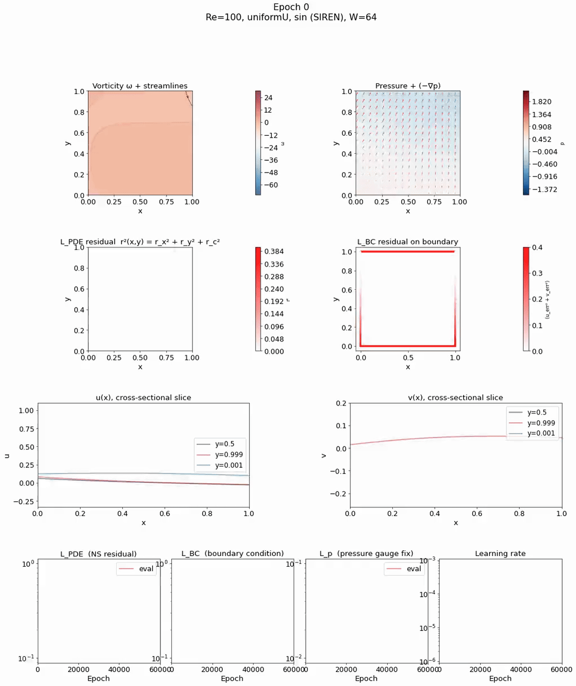

# PINN, Lid Driven Cavity Flow

A neural network trained to solve a fluid flow problem by satisfying the governing physics equations directly — no mesh, no simulation.

<p align="center">
  
</p>
<p align="center"><em>The top lid moves at u = 1, driving a recirculating asymettric vortex inside the flow domain. The three wall boundaries are stationary (no slip condition).</em></p>

<p align="center">
  
</p>
<p align="center"><em>Training animation — sin network, W=64, 12,867 parameters, Re=100, uniform lid, 36,000 epochs. Left: vorticity field + velocity vectors. Center: pressure field + −∇p vectors. Right: streamfunction isolines.</em></p>

---

## The Problem

**Setup:** A unit square box filled with viscous fluid. The top wall (the "lid") slides horizontally at speed u=1. The other three walls are fixed. The fluid inside circulates in a vortex — a standard test case in computational fluid dynamics (CFD) called the *lid-driven cavity*.

**Goal:** Find the velocity field `(u, v)` and pressure field `p` everywhere inside the box at steady state. `u` and `v` are the x- and y-direction velocity components; `p` is scalar pressure.

**Our approach:** Traditional CFD solvers discretize the domain onto a mesh and solve the equations numerically at each grid point. Instead, we train a neural network `f(x, y) → (u, v, p)` to satisfy the governing equations at selected points inside the flow domain simultaneously.

---

## Governing Equations

The solution must satisfy the incompressible Navier-Stokes equations at Re=100. (Note that Re characterize the ratio of inertial to viscous forces.  Re=100 places the flow firmly in the laminar regime. At Re~5,000–10,000 the flow becomes turbulent and far harder to solve numerically.)

**x direction momentum:**
$$u \frac{\partial u}{\partial x} + v \frac{\partial u}{\partial y} = -\frac{\partial p}{\partial x} + \nu \left(\frac{\partial^2 u}{\partial x^2} + \frac{\partial^2 u}{\partial y^2}\right)$$

**y direction momentum:**
$$u \frac{\partial v}{\partial x} + v \frac{\partial v}{\partial y} = -\frac{\partial p}{\partial y} + \nu \left(\frac{\partial^2 v}{\partial x^2} + \frac{\partial^2 v}{\partial y^2}\right)$$

**Mass conservation (incompressibility):**
$$\frac{\partial u}{\partial x} + \frac{\partial v}{\partial y} = 0$$

**Boundary conditions:** no-slip on all four walls — fluid at each wall matches the wall velocity. Three walls are fixed (u=v=0); fluid at the lid moves at u=1, v=0.

---

## The PINN Approach

The network is trained by minimizing a residual with three terms:

$$\mathcal{L} = 10 \cdot \mathcal{L}_{BC} + \mathcal{L}_{PDE} + 10 \cdot \mathcal{L}_{p}$$

- **`L_BC`** — boundary condition error on all four walls (`N_b = 1,000` wall points)
- **`L_PDE`** — NS residual at collocation points: $\frac{1}{N_f}\sum(r_x^2 + r_y^2 + r_c^2)$, where `r_x`, `r_y`, `r_c` are the x-momentum, y-momentum, and continuity residuals
- **`L_p`** — pressure gauge: pins `p(0.5, 0.5) = 0` to fix the free constant (incompressible NS only determines pressure up to an additive constant)

The factor of 10 on `L_BC` and `L_p` prioritizes boundary satisfaction over interior accuracy early in training.

`L_PDE` requires evaluating the NS residual at `N_f = 10,000` random interior *collocation points* each epoch. This in turn requires spatial derivatives of the network outputs — we use PyTorch autograd to compute them exactly:

```python
x_f = torch.rand(N_f, 1, requires_grad=True)   # collocation points
u_x  = grad(u.sum(), x_f, create_graph=True)[0] # ∂u/∂x
u_xx = grad(u_x.sum(), x_f, create_graph=True)[0] # ∂²u/∂x²
```

<details>
<summary><strong>Note: why <code>requires_grad=True</code> on collocation points doesn't update them</strong></summary>

The autograd computation graph and the optimizer are two separate objects:

- **Autograd:** Builds a computation graph to record the sequence of operations that produces each tensor. `.backward()` traverses this graph in reverse via the chain rule to compute gradients for every tensor in the graph, including `x_f` and the network weights.
- **Optimizer:** a separate object with a list of tensors to update. `Adam(model.parameters())` only knows about the weights.

So `x_f.grad` is populated after `.backward()` but never used by the optimizer. The collocation points are resampled fresh every epoch anyway.
</details>

---

## Network Architecture

```
(x, y)  →  [sin] × 4  →  (u, v, p)
```

Default: `[2, 64, 64, 64, 64, 3]` — 12,867 parameters. ReLU cannot be used because the NS residual requires second-order spatial derivatives, which vanish for ReLU. We experiment with tanh and sin activations.

<p align="center">
  
</p>

### Sinusoidal Activation

```
tanh network:  x  →  tanh(W x + b)
sin  network:  x  →  sin(ω₀ · W x + b)
```

In wide tanh networks, pre-activations scale like $\sqrt{\text{width}}$, pushing neurons into saturation, and its derivatives collapse to zero, which directly hurts `L_PDE`, since the NS residual requires 2nd-order spatial derivatives.

sin avoids this by a proper initialization that keeps pre-activations in `[−π, π]` at any width. The first layer uses `U(−1/n_in, 1/n_in)`. The hidden layers use $U\left(-\frac{\sqrt{6/n_\text{in}}}{\omega_0},\ +\frac{\sqrt{6/n_\text{in}}}{\omega_0}\right)$. We use `ω₀ = 1.0`. Every derivative of sin is also a sin or cos, so the gradients flow cleanly throughout the network.

<p align="center">
  
</p>
<p align="center"><em>tanh saturates to ±1 for large inputs — its derivatives collapse to zero. sin stays oscillatory at all amplitudes.</em></p>

---

## Results

### Width Sweep

We train 10 networks with doubling width from 4 to 2048, with both tanh and sin activations, and measure how accuracy scales with model size.

- LR scales as `lr = 1e-3 × (64/W)` — μP-inspired, keeps effective update magnitude constant across widths
- Training terminates automatically via `ReduceLROnPlateau(factor=0.3, patience=3000 epochs)` when `lr < lr_initial × 1e-3`

<p align="center">
  
</p>
<p align="center"><em>Percent velocity error vs layer width. tanh degrades at w>64; sin network peaks at w=1024 (0.23% error) then degrades at w=2048.</em></p>

Error decreases slowly past w=32 because N_f is held fixed at 10,000 while model size grows ~4× per step; by Chinchilla scaling, $N_f \propto N_\text{params}$, so the collocation budget should grow proportionally with the model.

#### sin network sweep

| Width | Model size | N_f | Epochs | Train time | eval_L_pde | u_ghia | \|Δu\| |
|------:|-----------:|----:|-------:|-----------:|-----------:|-------:|------:|
| 4 | 87 | 10,000 | 25,500 | 6 min | 2.129e-02 | 0.6125 | 0.1247 |
| 8 | 267 | 10,000 | 35,500 | 11 min | 1.494e-02 | 0.6700 | 0.0672 |
| 16 | 915 | 10,000 | 49,500 | 16 min | 4.558e-03 | 0.7287 | 0.0086 |
| 32 | 3.4K | 10,000 | 49,000 | 15 min | 2.215e-03 | 0.7419 | 0.0047 |
| 64 | 12.9K | 10,000 | 45,000 | 17 min | 1.378e-03 | 0.7404 | 0.0032 |
| 128 | 50.3K | 10,000 | 42,500 | 29 min | 8.423e-04 | 0.7400 | 0.0027 |
| 256 | 199K | 10,000 | 38,500 | 57 min | 1.962e-03 | 0.7416 | 0.0044 |
| 512 | 791K | 10,000 | 43,000 | 2.5 h | 1.456e-03 | 0.7393 | 0.0021 |
| 1024 | 3.2M | 10,000 | 39,000 | 6.2 h | 1.914e-03 | 0.7389 | 0.0017 |
| 2048 | 12.6M | 10,000 | 43,000 | 23.8 h | 3.548e-03 | 0.7521 | 0.0148 |

All runs on Apple Silicon GPU (MPS). `u_ghia` is the predicted u-velocity at `(x=0.5, y=0.9609)`, compared against the Ghia et al. (1982) reference value of 0.73722 at Re=100.

---

## Appendix

### Training Dashboard

<p align="center">
  
</p>
<p align="center"><em>Dashboard animation — sin network, W=64, 12,867 parameters, Re=100, uniform lid, 36,000 epochs. Row 1: vorticity + pressure fields. Row 2: pointwise PDE residual + BC error. Row 3: cross-sectional u and v profiles. Row 4: loss curves and learning rate schedule.</em></p>

---

## Setup

```bash
uv sync
jupyter notebook
```

## File Structure

```
pinn.py                # tanh and sin network models, NS residual, boundary data
train.py               # Full training run
train_width.py         # Single width-sweep run
sweep_width.sh         # Orchestrator: 10 doubling widths in sequence
make_arch_diagram.py   # Generate assets/network_architecture.png
make_activation_fig.py # Generate assets/activation_comparison.png
make_error_fig.py      # Generate assets/error_vs_width.png
parse_sweep_logs.py    # Parse log files into CSVs
plot_sweep.py          # Plot loss & LR curves for all widths
notebook.ipynb         # Training driver and visualisation
results/               # width_sweep.csv, per-run logs, loss curves
pyproject.toml         # Dependencies
```

---

## References

- Sitzmann, V., Martel, J. N. P., Bergman, A. W., Lindell, D. B., & Wetzstein, G. (2020), *Implicit Neural Representations with Periodic Activation Functions.*, NeurIPS 2020. [arXiv:2006.09661](https://arxiv.org/abs/2006.09661)
- Ghia, U., Ghia, K. N., & Shin, C. T. (1982), *High-Re solutions for incompressible flow using the Navier-Stokes equations and a multigrid method.*, Journal of Computational Physics, 48(3), 387–411. [pdf link](https://www.msaidi.ir/upload/Ghia1982.pdf?i=1)
- Botella, O. & Peyret, R. (1998), *Benchmark Spectral Results on the Lid-Driven Cavity Flow.*, Computers & Fluids, 27, 421–433. [pdf link](https://cats2d.com/documentation/botellapeyret98.pdf) (higher-accuracy spectral benchmark for the same problem)
- Yang, G., Hu, E. J., Babuschkin, I., Sidor, S., Liu, X., Farhi, D., ... & Gao, J. (2022), *Tensor Programs V: Tuning Large Neural Networks via Zero-Shot Hyperparameter Transfer.*, arXiv:2203.03466. [arXiv:2203.03466](https://arxiv.org/pdf/2203.03466) (μP — learning rate scales as 1/width to keep update magnitude constant across network sizes.)
