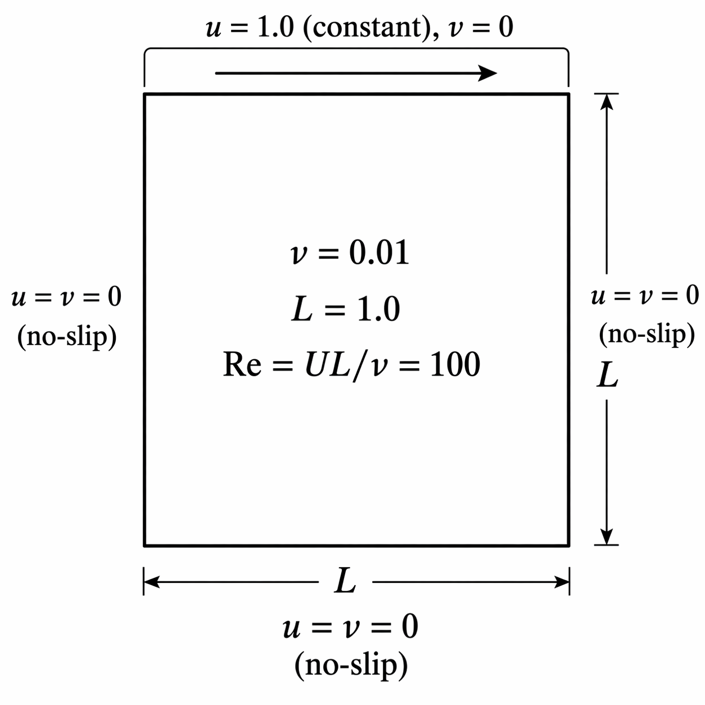
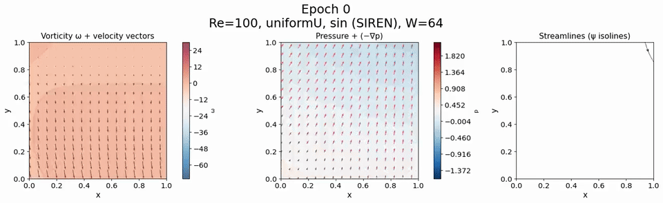
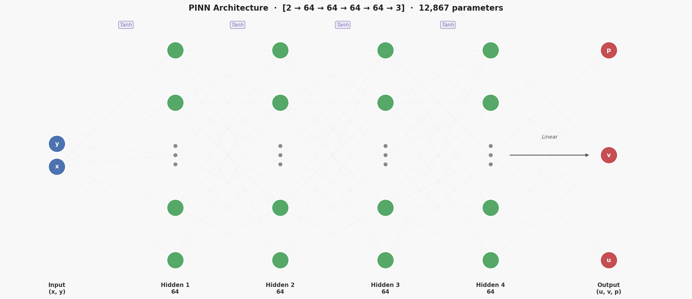
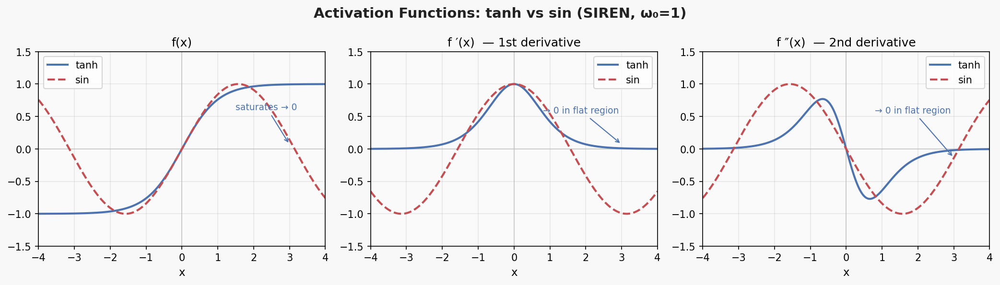
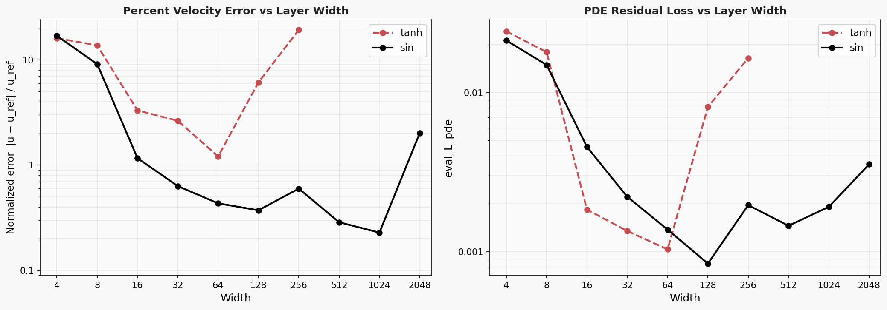

# PINN — Lid-Driven Cavity Flow

A neural network trained to solve a fluid flow problem by satisfying the governing physics equations directly — no mesh, no simulation.

<p align="center">
  
</p>
<p align="center"><em>The top lid moves at u = 1, driving a recirculating vortex inside the unit square. Three walls are stationary (no-slip).</em></p>

<p align="center">
  
</p>
<p align="center"><em>Training animation — Re=100, uniform lid, 1x network (12,867 parameters). Vorticity + streamlines, pressure + −∇p vectors, streamfunction isolines over 40,000 epochs.</em></p>

---

## The Problem

**Setup:** A unit square box filled with viscous fluid. The top wall (the "lid") slides horizontally at speed u=1. The other three walls are fixed. The fluid inside circulates in a vortex — a standard test case in computational fluid dynamics (CFD) called the *lid-driven cavity*.

**Goal:** Find the velocity field `(u, v)` and pressure field `p` everywhere inside the box at steady state. `u` and `v` are the x- and y-direction velocity components; `p` is scalar pressure.

**Our approach:** Traditional CFD solvers discretize the domain onto a mesh and solve the equations numerically at each grid point. Instead, we train a neural network `f(x, y) → (u, v, p)` to satisfy the governing equations at selected points inside the flow domain simultaneously.

---

## Governing Equations

The solution must satisfy the incompressible Navier-Stokes (NS) equations. *Incompressible* means the fluid density is constant (∇·u = 0). The Reynolds number Re=100 (ν=0.01) characterizes how viscous the fluid is; at Re=100 the flow is smooth and laminar.

**x-momentum:**
$$u \frac{\partial u}{\partial x} + v \frac{\partial u}{\partial y} = -\frac{\partial p}{\partial x} + \nu \left(\frac{\partial^2 u}{\partial x^2} + \frac{\partial^2 u}{\partial y^2}\right)$$

**y-momentum:**
$$u \frac{\partial v}{\partial x} + v \frac{\partial v}{\partial y} = -\frac{\partial p}{\partial y} + \nu \left(\frac{\partial^2 v}{\partial x^2} + \frac{\partial^2 v}{\partial y^2}\right)$$

**Mass conservation (incompressibility):**
$$\frac{\partial u}{\partial x} + \frac{\partial v}{\partial y} = 0$$

**Boundary conditions** — fluid velocity must match the wall velocity at every wall:

| Wall | Condition |
|------|-----------|
| Bottom (y=0) | u=0, v=0 |
| Top (y=1) — the lid | u=1, v=0 |
| Left (x=0) | u=0, v=0 |
| Right (x=1) | u=0, v=0 |

---

## The PINN Approach

The network outputs `(u, v, p)` at any `(x, y)`. The NS equations involve spatial derivatives of these outputs — we compute them exactly via PyTorch autograd:

```python
x_f = torch.rand(N_f, 1, requires_grad=True)   # collocation points
u_x  = grad(u.sum(), x_f, create_graph=True)[0] # ∂u/∂x
u_xx = grad(u_x.sum(), x_f, create_graph=True)[0] # ∂²u/∂x²
```

*Collocation points* are `N_f = 10,000` random interior points where the NS residual is evaluated each epoch.

The training loss penalizes three things simultaneously:

$$\mathcal{L} = 10 \cdot \mathcal{L}_{BC} + \mathcal{L}_{PDE} + 10 \cdot \mathcal{L}_{p}$$

- **`L_BC`** — boundary condition error on all four walls (`N_b = 1,000` wall points)
- **`L_PDE`** — NS residual at collocation points: $\frac{1}{N_f}\sum(r_x^2 + r_y^2 + r_c^2)$, where `r_x`, `r_y`, `r_c` are the x-momentum, y-momentum, and continuity residuals
- **`L_p`** — pressure gauge: pins `p(0.5, 0.5) = 0` to fix the free constant (incompressible NS only determines pressure up to an additive constant)

The factor of 10 on `L_BC` and `L_p` prioritizes boundary satisfaction over interior accuracy early in training.

<details>
<summary><strong>Note — why <code>requires_grad=True</code> on collocation points doesn't update them</strong></summary>

The autograd computation graph and the optimizer are two separate things:

- **Autograd** — records the sequence of operations that produced each tensor, building a computation graph. `.backward()` traverses this graph in reverse via the chain rule to compute gradients for every participating tensor, including `x_f` and the network weights.
- **Optimizer** — a separate object with an explicit list of tensors to update. `Adam(net.parameters())` only knows about the weights.

So `x_f.grad` is populated after `.backward()` but never read by the optimizer. The collocation points are resampled fresh every epoch anyway.
</details>

---

## Network Architecture

```
(x, y)  →  [Linear → tanh/sin] × 4  →  Linear  →  (u, v, p)
```

Default: `[2, 64, 64, 64, 64, 3]` — 12,867 parameters. ReLU cannot be used because the NS residual requires second-order spatial derivatives, which vanish for ReLU. We experiment with tanh and sin activations.

<p align="center">
  
</p>

### Sinusoidal Activation (sin network)

Sitzmann et al. show that replacing tanh with sin — and using a matching initialization — gives much better derivative accuracy. This matters here because `L_PDE` requires 2nd-order spatial derivatives.

```
tanh network:  x  →  tanh(W x + b)
sin  network:  x  →  sin(ω₀ · W x + b)
```

The initialization keeps pre-activations uniformly distributed over `[−π, π]` through depth. The first layer uses `U(−1/n_in, 1/n_in)`; hidden layers use `U(−√(6/n_in)/ω₀, +√(6/n_in)/ω₀)`. We use `ω₀ = 1.0`.

- For `sin`, every derivative is also a `sin` or `cos` — nonzero everywhere, gradient signal flows cleanly.
- In wide tanh networks, pre-activations grow like `√width`, saturating neurons. The sin init prevents this.

<p align="center">
  
</p>
<p align="center"><em>tanh saturates to ±1 for large inputs — its derivatives collapse to zero. sin stays oscillatory at all amplitudes.</em></p>

---

## Results

### Width Sweep

We train 10 networks doubling width from 4 → 2048, with both tanh and sin activations, to measure how accuracy scales with capacity.

- LR scales as `lr = 1e-3 × (64/W)` — μP-inspired, keeps effective update magnitude constant across widths
- Self-terminating via `ReduceLROnPlateau(factor=0.3, patience=3000 epochs)` when `lr < lr_initial × 1e-3`

<p align="center">
  
</p>
<p align="center"><em>Percent velocity error vs layer width. tanh degrades at w≥128; sin errors decrease consistently to 0.23% at w=1024.</em></p>

#### tanh baseline

| Width | Params | Epochs | eval_L_pde | u_ghia | Error vs Ghia |
|------:|-------:|-------:|-----------:|-------:|--------------:|
| 4 | 87 | 22,000 | 2.427e-02 | 0.6188 | 0.1184 |
| 8 | 267 | 32,500 | 1.799e-02 | 0.6360 | 0.1012 |
| 16 | 915 | 54,000 | 1.840e-03 | 0.7128 | 0.0244 |
| 32 | 3,363 | 45,000 | 1.350e-03 | 0.7178 | 0.0194 |
| 64 | 12,867 | 39,000 | 1.035e-03 | 0.7283 | 0.0089 |
| 128 | 50,307 | 26,500 | 8.131e-03 | 0.6922 | **0.0450 ↑** |
| 256 | 198,915 | 22,000 | 1.648e-02 | 0.5954 | **0.1418 ↑** |

#### sin network sweep (width 2048 in progress)

| Width | Params | N_f | Epochs | eval_L_pde | u_ghia | Error vs Ghia |
|------:|-------:|----:|-------:|-----------:|-------:|--------------:|
| 4 | 87 | 10,000 | 25,500 | 2.129e-02 | 0.6125 | 0.1247 |
| 8 | 267 | 10,000 | 35,500 | 1.494e-02 | 0.6700 | 0.0672 |
| 16 | 915 | 10,000 | 49,500 | 4.558e-03 | 0.7287 | 0.0086 |
| 32 | 3,363 | 10,000 | 49,000 | 2.215e-03 | 0.7419 | 0.0047 |
| 64 | 12,867 | 10,000 | 45,000 | 1.378e-03 | 0.7404 | 0.0032 |
| 128 | 50,307 | 10,000 | 42,500 | 8.423e-04 | 0.7400 | 0.0027 |
| 256 | 198,915 | 10,000 | 38,500 | 1.962e-03 | 0.7416 | 0.0044 |
| 512 | 791,043 | 10,000 | 43,000 | 1.456e-03 | 0.7393 | 0.0021 |
| 1024 | 3,154,947 | 10,000 | 39,000 | 1.914e-03 | 0.7389 | **0.0017 ← best** |
| 2048 | — | 10,000 | — | — | — | running... |

`u_ghia` is the predicted u-velocity at `(x=0.5, y=0.9609)` — the vertical centerline just below the lid — compared against the Ghia et al. (1982) reference value of **0.73722** at Re=100.

---

## Appendix

### Training Dashboard

<p align="center">
  
</p>
<p align="center"><em>
<strong>Row 1:</strong> Vorticity field with streamlines (left); pressure field with −∇p vectors (right).<br>
<strong>Row 2:</strong> Pointwise PDE residual (left); boundary condition error on all four walls (right).<br>
<strong>Row 3:</strong> Cross-sectional u and v profiles at y = 0.001, 0.5, 0.999.<br>
<strong>Row 4:</strong> Training and evaluation loss curves (log scale).
</em></p>

At epoch 27,000 the network predicts u = 0.7225 at (x=0.5, y=0.9609), within 2% of the Ghia et al. (1982) reference value of 0.73722.

---

## Setup

```bash
uv sync
jupyter notebook
```

## File Structure

```
pinn.py                # tanh and sin network models, NS residual, boundary data
train.py               # Full training run
train_width.py         # Single width-sweep run
sweep_width.sh         # Orchestrator: 10 doubling widths in sequence
make_arch_diagram.py   # Generate assets/network_architecture.png
make_activation_fig.py # Generate assets/activation_comparison.png
make_error_fig.py      # Generate assets/error_vs_width.png
parse_sweep_logs.py    # Parse log files into CSVs
plot_sweep.py          # Plot loss & LR curves for all widths
notebook.ipynb         # Training driver and visualisation
results/               # width_sweep.csv, per-run logs, loss curves
pyproject.toml         # Dependencies
```

---

## References

- Sitzmann, V., Martel, J. N. P., Bergman, A. W., Lindell, D. B., & Wetzstein, G. (2020), *Implicit Neural Representations with Periodic Activation Functions.*, NeurIPS 2020. [arXiv:2006.09661](https://arxiv.org/abs/2006.09661)
- Ghia, U., Ghia, K. N., & Shin, C. T. (1982), *High-Re solutions for incompressible flow using the Navier-Stokes equations and a multigrid method.*, Journal of Computational Physics, 48(3), 387–411. [link](https://www.msaidi.ir/upload/Ghia1982.pdf?i=1)
- Botella, O. & Peyret, R. (1998), *Benchmark Spectral Results on the Lid-Driven Cavity Flow.*, Computers & Fluids, 27, 421–433. [DOI:10.1016/S0045-7930(98)00024-6](https://doi.org/10.1016/S0045-7930(98)00024-6) (higher-accuracy spectral benchmark for the same problem)
- Yang, G., Hu, E. J., Babuschkin, I., Sidor, S., Liu, X., Farhi, D., ... & Gao, J. (2022), *Tensor Programs V: Tuning Large Neural Networks via Zero-Shot Hyperparameter Transfer.*, arXiv:2203.03466. [arXiv:2203.03466](https://arxiv.org/pdf/2203.03466) (μP — learning rate scales as 1/width to keep update magnitude constant across network sizes.)
